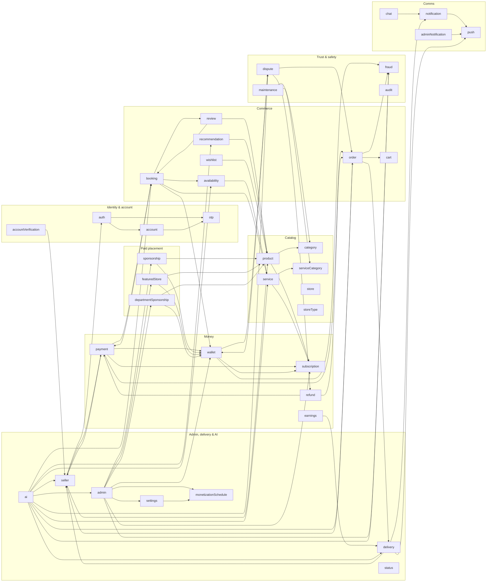

# Architecture

Phase RF6 deliverable. This document is a **module-level reference**: what
each of the 40 backend modules is responsible for, its HTTP mount point (if
any), and which other modules it depends on. It complements
`docs/ARCHITECTURE_REVIEW.md`, which is the **system-level** map (overall
topology, deployment, cross-cutting concerns, architectural trade-offs) —
read that one first if you're new to the codebase; use this one as a
reference when working in or around a specific module.

For endpoint-level detail (methods, paths, request/response shapes), see
`docs/openapi.yaml` (machine-readable) or `docs/API.md` (human-readable
table). For the schema those modules read/write, see `docs/DATABASE.md`.

## 1. Module boundary pattern

Every backend domain under `backend/src/modules/<name>/` follows the same
shape (not every module has every file — see the table below):

```
<name>.routes.js       — route → middleware → controller wiring (HTTP surface, if any)
<name>.controller.js   — HTTP concerns only (req/res, status codes)
<name>.service.js      — business logic
<name>.repository.js   — SQL, parameterized queries via mysql2
<name>.validator.js    — express-validator request validation
```

Cross-module calls go through a module's exported **service** functions
(e.g. `payment.service.js` calling `walletService.creditSellersForOrder`),
never reaching into another module's repository directly. The dependency
column below was extracted by scanning every module's `require("../<other>/…")`
calls, so it reflects this convention: an edge `A → B` means a file in `A`
requires something from `B` (almost always `B`'s service).

**5 of the 40 modules have no `routes.js`/`controller.js` at all** —
`audit`, `fraud`, `monetizationSchedule`, `otp`, `refund`. These are
internal-only: pure service/repository pairs called from other modules'
services, with no direct HTTP surface of their own. They're included in the
table below (mount point shows "no HTTP routes") but are absent from
`docs/openapi.yaml`, which only documents the 35 modules that do have
routes.

## 2. Module reference

| Module | Mount point | Responsibility | Depends on |
|---|---|---|---|
| `account` | `/api/v1/account` | Signed-in user's own profile, settings, and password/account-deletion flows. | `adminNotification`, `audit`, `otp` |
| `accountVerification` | `/api/v1/admin/account-verifications` | Admin review queue for seller identity/business verification submissions. | `notification`, `seller` |
| `admin` | `/api/v1/admin` | Admin-only dashboard, analytics, moderation, and platform-control endpoints. Router-level `authorize("admin")`. | `account`, `adminNotification`, `audit`, `auth`, `departmentSponsorship`, `featuredStore`, `fraud`, `monetizationSchedule`, `notification`, `refund`, `settings`, `sponsorship`, `subscription`, `wallet` |
| `adminNotification` | `/api/v1/admin/notifications` | Admin-facing notification feed, separate from the per-user `notification` module (see `docs/DATABASE.md`'s `admin_notifications` entry for why). | `push` |
| `ai` | `/api/v1/ai` | Nexora AI: buyer chat/search/recommend (Part B, Phase B1), seller draft-generation (B2), admin copilot (B3). Advisory only — never auto-executes. | `admin`, `availability`, `booking`, `delivery`, `dispute`, `fraud`, `order`, `recommendation`, `seller`, `service`, `settings` |
| `audit` | _(no HTTP routes)_ | Append-only audit trail (`audit_log`). Written to by other modules' services; read back via `admin`'s audit-logs endpoint. | _(none)_ |
| `auth` | `/api/v1/auth` | Registration, password login with optional OTP step, password reset. Public. | `account`, `adminNotification`, `audit`, `otp` |
| `availability` | `/api/v1/services` | Per-date bookable capacity/price overrides for a service, feeding the booking engine. | `service` |
| `booking` | `/api/v1/bookings` | Services-side equivalent of `order` — creation, provider confirm/reject, cancel, lookup. | `availability`, `notification`, `payment`, `review`, `service`, `wallet` |
| `cart` | `/api/v1/cart` | Buyer's shopping cart for product purchases. | _(none)_ |
| `category` | `/api/v1/categories` | Product category/department taxonomy, including department maintenance-mode toggles. | _(none)_ |
| `chat` | `/api/v1/chat` | Buyer/seller/delivery-agent messaging — conversations, messages, reactions, read receipts. Real-time fan-out via `socket/socket.js`. | `notification` |
| `delivery` | `/api/v1/delivery` | Delivery agent assignment, offer dispatch, live tracking, buyer delivery confirmation. | `earnings`, `notification`, `order`, `push`, `seller`, `settings` |
| `departmentSponsorship` | `/api/v1/seller/department-sponsorship` | Paid department-level sponsorship placement campaigns. | `category`, `notification`, `product`, `settings`, `wallet` |
| `dispute` | `/api/v1/disputes` | Buyer/seller dispute filing and evidence upload; admin resolution lives in `admin`. | `adminNotification`, `notification`, `order`, `refund`, `wallet` |
| `earnings` | `/api/v1/earnings` | Delivery agent earnings ledger (per-delivery payouts). | `delivery`, `settings` |
| `featuredStore` | `/api/v1/seller/featured-store` | Paid featured-store placement campaigns. | `category`, `notification`, `product`, `settings`, `wallet` |
| `fraud` | _(no HTTP routes)_ | Fraud-flag detection/storage. Flags are surfaced to admins via `admin`'s fraud-flags endpoints. | `adminNotification` |
| `maintenance` | `/api/v1/admin/maintenance` | Admin toggles for department/service-category maintenance windows, immediate and scheduled. | `category`, `serviceCategory` |
| `monetizationSchedule` | _(no HTTP routes)_ | Scheduled future flips of the monetization master-switch flags; driven by `jobs/monetizationSchedule.job.js`. Admin-facing CRUD for schedules lives in `admin`. | `audit`, `push`, `settings` |
| `notification` | `/api/v1/notifications` | Per-user notification feed (in-app + push fan-out). | `push` |
| `order` | `/api/v1/orders` | Product-side order lifecycle — checkout, multi-vendor splitting, buyer/seller views, receipt confirmation. | `audit`, `cart`, `delivery`, `fraud`, `notification`, `seller` |
| `otp` | _(no HTTP routes)_ | One-time-passcode generation/verification, used by `auth` (login) and `account` (password change). | _(none)_ |
| `payment` | `/api/v1/payments` | Payment initiation/checkout across all providers (MalipoPay, Selcom, Snippe, PayPal) and their webhooks, for both orders and bookings, plus the seller verification fee. | `audit`, `booking`, `notification`, `order`, `seller`, `settings`, `subscription`, `wallet` |
| `product` | `/api/v1/products` | Seller product listings — CRUD, media, activation, search/filter metadata. Reads may be served from the RF5 Redis cache (see §4). | `category`, `subscription` |
| `push` | `/api/v1/push` | Web Push subscription registration, used by `notification`/`delivery`/`adminNotification`. | _(none)_ |
| `recommendation` | `/api/v1/recommendations` | Buyer-facing "related/recommended products" surface. | `product` |
| `refund` | _(no HTTP routes)_ | Refund issuance against a payment/order, invoked from `dispute` and `admin`. | `audit`, `order`, `payment` |
| `review` | `/api/v1/reviews` | Product and booking reviews, with seller replies and photo attachments. | `booking`, `notification`, `product` |
| `seller` | `/api/v1/seller` | Seller/provider profile — branding, verification status, collections, merchant type. | `auth`, `notification`, `payment`, `product`, `settings` |
| `service` | `/api/v1/services` | Service-provider bookable listings (services-side equivalent of `product`). | `serviceCategory`, `subscription` |
| `serviceCategory` | `/api/v1/service-categories` | Service taxonomy (Accommodation, Transportation, Tourism, …), analogous to `category`. | _(none)_ |
| `settings` | `/api/v1/settings` | Key/value platform settings (`platform_settings` EAV table), including the monetization master switch. | `audit`, `monetizationSchedule` |
| `sponsorship` | `/api/v1/seller/sponsorship` | Paid product sponsorship campaigns. | `notification`, `product`, `settings`, `wallet` |
| `status` | `/api/v1/status` | Public status-page/incident feed. | _(none)_ |
| `store` | `/api/v1/stores` | Public storefront view of a seller (product side). | _(none)_ |
| `storeType` | `/api/v1/store-types` | Store type taxonomy sellers select from at signup. | _(none)_ |
| `subscription` | `/api/v1/subscriptions` | Seller subscription plans and the commission rate they unlock. | `payment`, `settings` |
| `wallet` | `/api/v1/wallet` | Seller/provider wallet balance, withdrawals, and escrow crediting — the shared money layer for both products and services. | `dispute`, `fraud`, `notification`, `order`, `settings`, `subscription` |
| `wishlist` | `/api/v1/wishlist` | Buyer's saved-for-later product list. | `product` |

A few mount points are shared or nested rather than 1:1 with a module name,
worth calling out explicitly:

- `service` and `availability` both mount under `/api/v1/services` —
  `availability` only adds nested `/:serviceId/availability` sub-paths, it
  doesn't duplicate `service`'s own routes.
- `sponsorship`, `featuredStore`, and `departmentSponsorship` all mount
  under `/api/v1/seller/…` alongside the base `seller` module (which itself
  owns bare `/api/v1/seller`) — three separate placement-type modules
  sharing a URL namespace and the same admin-oversight pattern (see
  `docs/API.md`).
- `accountVerification`, `adminNotification`, and `maintenance` all mount
  under `/api/v1/admin/…` alongside `admin` itself.

## 3. Dependency graph, visually

Same edges as the table above, grouped by rough subsystem. An edge always
means "the arrow's tail module calls into the arrow's head module's
service" — never the reverse, and never through a repository directly.



`wallet` and `payment` sit at the center of the graph by design — see
`docs/ARCHITECTURE_REVIEW.md` §4 ("both models converge on the same
`payment.service.js`/`wallet.service.js`/escrow machinery") for why that's
the single biggest blast-radius fact in the codebase: a change to either
module can affect products *and* services simultaneously.

## 4. Supporting infrastructure

Not modules themselves, but what the module layer runs on top of:

| Layer | Location | Notes |
|---|---|---|
| Database pool | `config/db.js` | mysql2 pool, `connectionLimit` configurable via `DB_POOL_CONNECTION_LIMIT` (default `10`); emits saturation warnings to logs + Sentry when the pool has to queue a request (RF4). |
| Read replica config | `config/dbRead.js` | Separate read-oriented connection config, used where a module explicitly opts into read/write splitting. |
| Cache | `config/redis.js`, `utils/cache.js` | `ioredis` client, lazily built; `null` (pass-through to direct DB reads) when `REDIS_URL` is unset. Currently caches `category`'s and `product`'s public browse/listing reads only (30–60s TTL, versioned-key invalidation) — see §6.6 of `docs/DEPLOYMENT.md` and the "Caching" note in `docs/DATABASE.md` (RF5). |
| Media storage | `config/cloudinary.js` | Product/service/review images, seller logos/banners, chat attachments. |
| Email | `config/brevo.js`, `config/email.js` | Transactional email (OTP, password reset, notifications digest); falls back to a simulated no-network send outside `NODE_ENV=production` when `BREVO_API_KEY` is unset. |
| Web Push | `config/webPush.js` | Backs the `push` module. |
| Error tracking | `config/sentry.js` | Conditional on `SENTRY_DSN`; also receives the DB-pool saturation warnings above. |
| Delivery routing | `services/routing/` | Road-routing ETA calculation used by `delivery`'s dispatch-delay flag. |
| Real-time | `socket/socket.js` | Socket.IO, same process as the HTTP API — chat, notifications, delivery tracking, `payment:updated`. |
| Scheduled jobs | `jobs/*.job.js` (+ `jobs/index.js`) | In-process `node-cron` jobs: `escrowRelease`, `bookingLifecycle`, `staleOrders`, `otpCleanup`, `sponsorshipExpiry`, `featuredStoreExpiry`, `departmentSponsorshipExpiry`, `departmentMaintenanceSchedule`, `monetizationSchedule`, `webhookReplayCleanup`. Each corresponds to one or more modules above (e.g. `escrowRelease.job.js` drives `wallet`). |
| Cross-cutting middleware | `middleware/*.js` | Auth, authorization, rate limiting, webhook auth, file-content validation, per-role gates (`requireApprovedSeller`, `requireServiceProvider`, `requireSuperAdmin`, `requireApprovedDeliveryAgent`, `requireVerificationFeePaid`), maintenance-mode gate, locale, request logging, centralized error handling. Full table in `docs/ARCHITECTURE_REVIEW.md` §6. |

## 5. Where to go next

- **System-level shape, deployment, trade-offs:** `docs/ARCHITECTURE_REVIEW.md`
- **Endpoint-by-endpoint detail:** `docs/openapi.yaml` (OpenAPI 3.0) or `docs/API.md`
- **Schema, migrations, DB testing:** `docs/DATABASE.md`
- **Payment/escrow flow specifically:** `docs/ESCROW_PAYMENT_FLOW.md`, `docs/ESCROW_ANALYSIS.md`
- **Deployment/runtime config, including Redis and DB pool tuning:** `docs/DEPLOYMENT.md`
