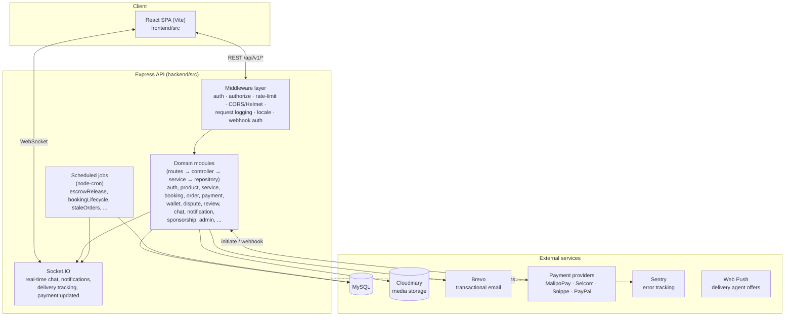
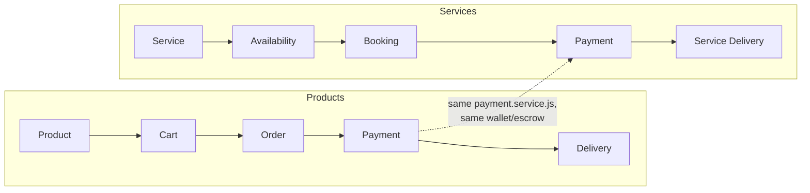

# Architecture Review

Phase 3 (External Review Readiness) deliverable. A single entry point
for an external architecture reviewer: what the system is, how its
pieces fit together, and where to look in the repo for the authoritative
detail on any given piece. This document doesn't replace `docs/API.md`,
`docs/DATABASE.md`, `docs/DEPLOYMENT.md`, or `docs/SRS.md` — it sits
above them as a map.

## 1. System overview

NEXORA is a multi-vendor marketplace with two commerce models sharing
one platform:

- **Products** — traditional cart → order → payment → delivery, for
  physical/digital goods sold by sellers.
- **Services** — a booking engine (accommodation, transportation, tours,
  event spaces, etc.) built as a *second* domain reusing the same
  payment, wallet, escrow, review, and notification infrastructure
  rather than duplicating it — see `CHANGES.md` for the original design
  intent ("Build One Booking Engine") and `docs/DATABASE.md` for the
  schema this produced.

Four user roles: **Buyers/Customers**, **Sellers/Providers**, **Delivery
agents**, **Admins**. A merchant can be a pure product seller, a pure
service provider, or hybrid — see `CHANGES.md`'s `MerchantType` enum.

## 2. High-level architecture



## 3. Module boundary pattern

Every backend domain follows the same four-file shape (see
`docs/API.md`'s module table for the full list):

```
modules/<domain>/
  <domain>.routes.js       — route → middleware → controller wiring
  <domain>.controller.js   — HTTP concerns only (req/res, status codes)
  <domain>.service.js      — business logic
  <domain>.repository.js   — SQL, parameterized queries via mysql2
  <domain>.validator.js    — request validation (where present)
```

This consistency is the main thing that makes the codebase reviewable
at scale — a reviewer who understands one module's shape can navigate
any other module the same way. Cross-module calls go through a
service's exported functions (e.g. `payment.service.js` calling
`walletService.creditSellersForOrder`), never reaching into another
module's repository directly.

## 4. Data flow: the two commerce models side by side



Both models converge on the same `payment.service.js` /
`wallet.service.js` / escrow machinery (see
`docs/ESCROW_PAYMENT_FLOW.md`) — this is intentional per `CHANGES.md`'s
"Reuse Existing Infrastructure" principle, and is the single most
important architectural fact for a reviewer assessing blast radius: a
change to payment/wallet code affects **both** products and services,
not just one.

## 5. Deployment topology

See `docs/DEPLOYMENT.md` for the full walkthrough. Summary for a
reviewer assessing the runtime environment:

- **Frontend**: static build (Vite) — deployable to any static host/CDN.
- **Backend**: single Node/Express process behind a reverse proxy
  (`docker-compose.test.yml` / Render references in `app.js`'s
  `trust proxy` comment indicate Render as the reference deployment
  target, though the app isn't hard-coded to any one PaaS).
- **Database**: MySQL, schema managed via sequential numbered migrations
  (`database/migrations`, 67+ at time of writing) with matching seeders
  — no ORM; queries are hand-written and parameterized (`mysql2`).
- **Scheduled jobs**: run in-process via `node-cron`
  (`backend/src/jobs`), not a separate worker deployment — a reviewer
  assessing scaling should note this means jobs and the API server
  currently share the same process/instance.
- **Real-time**: Socket.IO, same process as the HTTP API.

## 6. Cross-cutting concerns and where they live

| Concern | Where | Notes |
|---|---|---|
| Authentication | `middleware/auth.middleware.js` | JWT, re-checks account status per-request |
| Authorization | `middleware/authorize.middleware.js` | Role-based, applied per-route |
| Rate limiting | `middleware/rateLimit.middleware.js` | Tiered: strict on auth, loose platform-wide |
| Webhook auth | `middleware/webhookAuth.middleware.js` + `providers/snippe.provider.js` | See `docs/WEBHOOK_VALIDATION.md` |
| Error handling | `middleware/errorHandler.js` | Centralized; 4xx vs 5xx split for logging/Sentry severity |
| Structured logging | `utils/logger.js` (Phase 2) | pino, redacts credentials |
| Observability | `config/sentry.js` (Phase 2) | Conditional on `SENTRY_DSN` |
| i18n | `i18n/` + `middleware/locale.middleware.js` | English/Swahili |
| Escrow / payment trust | `wallet.service.js`, `jobs/escrowRelease.job.js` | See `docs/ESCROW_PAYMENT_FLOW.md` |
| CI/CD & static analysis | `.github/workflows/` (Phase 1) | lint, test, `npm audit`, CodeQL |

## 7. Known architectural trade-offs (flagged for reviewer judgment)

These are deliberate decisions already made in the codebase, surfaced
here so an external reviewer can weigh in rather than discover them
independently:

- **In-process scheduled jobs, not a separate worker/queue.** Simple to
  operate at current scale; a reviewer assessing horizontal scaling
  should confirm this remains acceptable if the API is ever run as
  multiple instances (risk: the same job tick running redundantly on
  every instance unless guarded — worth checking `jobs/index.js`'s
  scheduling for any single-instance assumption before scaling out).
- **No ORM.** Direct parameterized SQL via `mysql2` throughout. Keeps
  query behavior explicit and auditable (a reviewer can read the exact
  SQL a repository runs) at the cost of more boilerplate than an ORM
  would need — a deliberate trade-off, not an oversight.
- **Fire-and-forget wallet crediting on the webhook path.**
  `creditSellersForOrder(...).catch(...)` in `_handleOrderPaymentWebhook`
  doesn't block the webhook response on wallet-crediting success; a
  failure is caught, logged, and reported to Sentry rather than failing
  the webhook response itself (which would trigger provider retry-storms
  for what might be a purely internal failure). This trades "guaranteed
  synchronous consistency" for "webhook responsiveness + robust
  after-the-fact error visibility" — see Phase 2's changelog for the
  reasoning, and `docs/ESCROW_PAYMENT_FLOW.md` for the flow this
  affects.
- **Single MySQL instance, no documented read-replica/sharding
  strategy.** Fine at current scale; a reviewer assessing growth
  headroom should treat this as a forward-looking item, not a current
  defect.

## 8. Suggested review path for an external reviewer

1. Start with `docs/SRS.md` for product scope, then this document for
   system shape.
2. Read `docs/ESCROW_PAYMENT_FLOW.md` and `docs/WEBHOOK_VALIDATION.md`
   together — payments are the highest-stakes subsystem in this
   codebase.
3. Use `docs/SECURITY_REVIEW_CHECKLIST.md` as the working punch list.
4. Reference `docs/API.md` / `docs/DATABASE.md` for ground-truth detail
   on any specific module encountered along the way.
