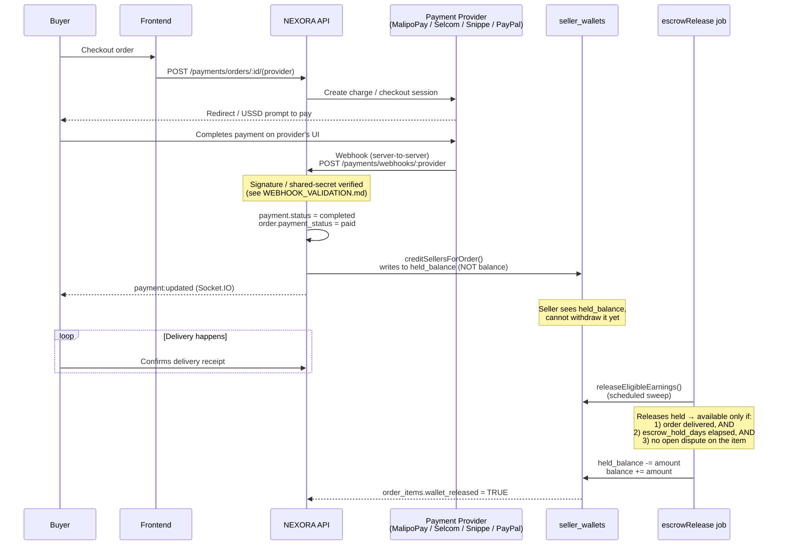
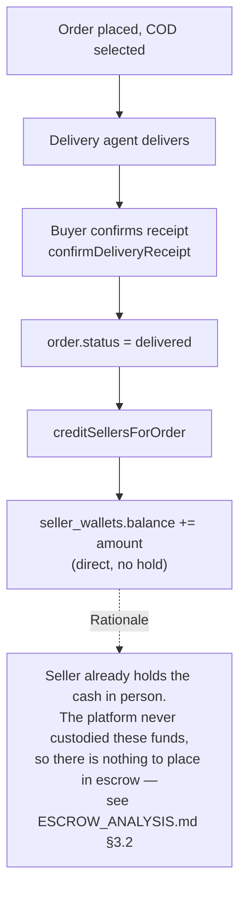
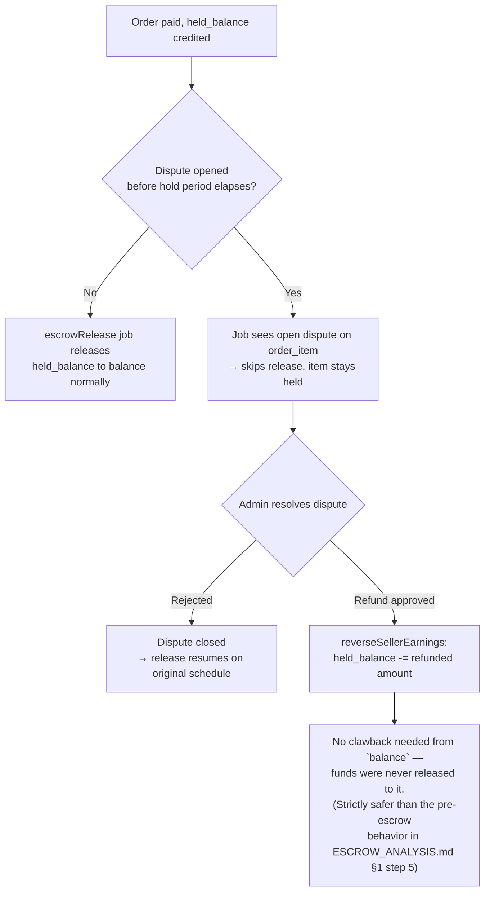
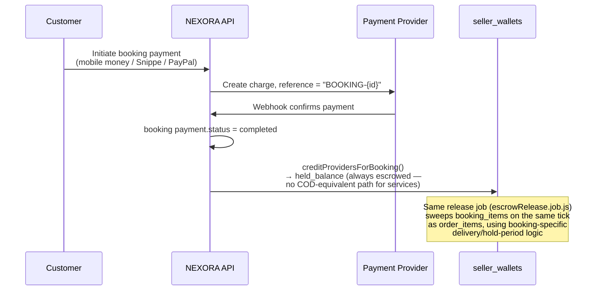
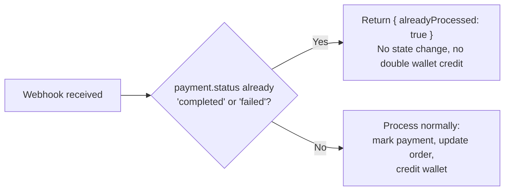

# Escrow & Payment Flow Diagrams

Phase 3 (External Review Readiness) deliverable. These diagrams show how
money actually moves through NEXORA today, as implemented in
`payment.service.js`, `wallet.service.js`, `dispute.service.js`, and the
`escrowRelease` job — cross-checked against the code, not aspirational.
They're meant to give an external reviewer (security/architecture audit)
a correct mental model without having to trace the call graph by hand.

Diagrams are [Mermaid](https://mermaid.js.org/), which renders natively
on GitHub. See `docs/ESCROW_ANALYSIS.md` for the original design
rationale (Phase 9A) — this document is the "what actually ships" picture
for 9B–9D plus the Services (booking) equivalent, not a re-derivation of
that design.

## 1. Order payment → seller payout (escrow) lifecycle

**Key invariant:** a seller's `balance` (withdrawable) is only ever
increased by the release job — never directly by the webhook handler.
This is what closes the gap described in `docs/ESCROW_ANALYSIS.md` §2
(sellers withdrawing before a dispute window closes).

## 2. Cash on Delivery (no escrow hold)

## 3. Dispute opened before release

## 4. Booking (Services) payment — same escrow model, single provider

## 5. Webhook idempotency (all providers)

This matters because every provider in this integration (MalipoPay,
Selcom, Snippe, PayPal capture callbacks) can legitimately redeliver the
same webhook (network retry, provider-side retry-storm on a slow
response, etc.). The idempotency check in
`_handleOrderPaymentWebhook`/`_handleBookingPaymentWebhook` is what
prevents a redelivered webhook from crediting a seller's wallet twice —
this is called out explicitly here because it's a correctness property
an external reviewer should be able to verify against the code
(`payment.service.js`), not something visible from the API surface alone.

## Reviewer notes / scope

- These diagrams describe **money movement and state transitions**, not
  the full HTTP contract — see `docs/API.md` for endpoints and
  `docs/WEBHOOK_VALIDATION.md` for how each webhook is authenticated.
- No behavior shown here changed as part of Phase 3 — this phase adds
  documentation only, so these diagrams are a description of Phases
  1–9(D)'s shipped behavior, not new functionality.
